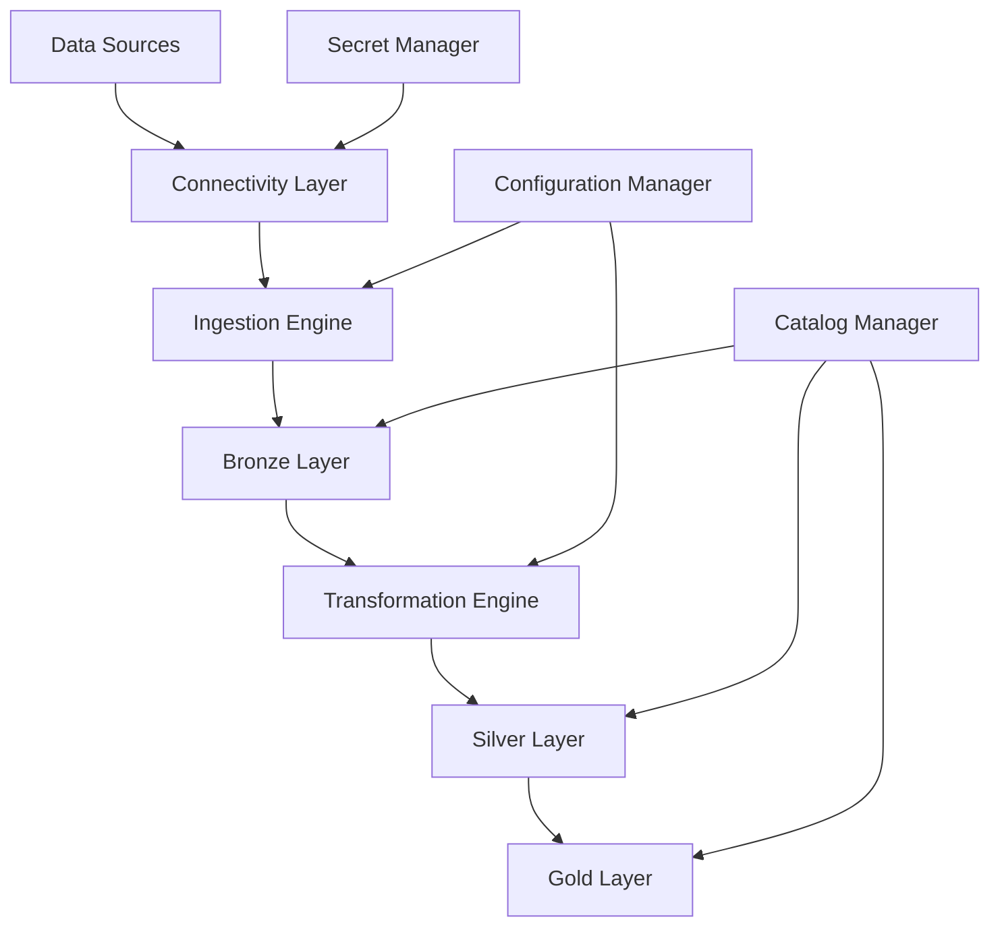

# Common Data Platform Documentation

Welcome to the Common Data Platform documentation. This comprehensive guide covers everything you need to know about implementing, configuring, and operating the modular data ingestion framework for Azure Databricks Lakehouse.

## 📚 Documentation Structure

### **Getting Started**
- [Quick Start Guide](getting-started/quick-start.md) - Get up and running in 15 minutes
- [Installation Guide](getting-started/installation.md) - Detailed setup instructions
- [First Pipeline](getting-started/first-pipeline.md) - Create your first data pipeline

### **Architecture**
- [Framework Overview](architecture/framework-overview.md) - High-level architecture
- [Unity Catalog Design](architecture/unity-catalog.md) - Catalog and schema structure
- [Security Model](architecture/security.md) - Authentication and authorization
- [Data Flow](architecture/data-flow.md) - Bronze → Silver → Gold flow

### **Configuration**
- [Configuration Guide](configuration/configuration-guide.md) - Complete configuration reference
- [Source Configuration](configuration/source-configuration.md) - Setting up data sources
- [Transformation Configuration](configuration/transformation-configuration.md) - Defining transformations
- [Environment Management](configuration/environment-management.md) - Dev/Test/Prod setup

### **Monitoring & Operations**
- [Monitoring Guide](monitoring/monitoring-guide.md) - Observability and alerting
- [Data Quality](monitoring/data-quality.md) - Quality checks and validation
- [Troubleshooting](monitoring/troubleshooting.md) - Common issues and solutions
- [Performance Tuning](monitoring/performance.md) - Optimization best practices

## 🚀 Quick Navigation

### **I want to...**

| Task | Documentation |
|------|---------------|
| Set up the framework for the first time | [Installation Guide](getting-started/installation.md) |
| Add a new Excel data source | [Source Configuration](configuration/source-configuration.md#excel-sources) |
| Ingest 7 Oracle tables | [Oracle Multi-Table Setup](configuration/source-configuration.md#oracle-multi-table) |
| Implement SCD Type 2 | [SCD Type 2 Guide](configuration/transformation-configuration.md#scd-type-2) |
| Monitor pipeline health | [Monitoring Guide](monitoring/monitoring-guide.md) |
| Troubleshoot a failed pipeline | [Troubleshooting](monitoring/troubleshooting.md) |
| Deploy to production | [Environment Management](configuration/environment-management.md#production-deployment) |

## 🏗️ Framework Components

## 📋 Prerequisites

Before getting started, ensure you have:

- ✅ **Azure Subscription** with Databricks workspace
- ✅ **Unity Catalog** enabled
- ✅ **Azure Key Vault** for secrets management
- ✅ **Azure Data Lake Storage Gen2** for file sources
- ✅ **Python 3.8+** development environment
- ✅ **Oracle Database** access (if using Oracle sources)

## 🆘 Getting Help

- **Documentation Issues**: Create an issue in the repository
- **Feature Requests**: Use the GitHub Issues template
- **Support**: Contact the Data Engineering team
- **Examples**: Check the `notebooks/examples/` directory

## 🔄 Version Information

- **Current Version**: 1.0.0
- **Supported Databricks Runtime**: 13.3.x LTS
- **Supported Unity Catalog**: All versions
- **Python Compatibility**: 3.8, 3.9, 3.10, 3.11

## 📖 Additional Resources

- [Azure Databricks Documentation](https://docs.microsoft.com/en-us/azure/databricks/)
- [Unity Catalog Best Practices](https://docs.databricks.com/data-governance/unity-catalog/)
- [Delta Lake Documentation](https://docs.delta.io/latest/)
- [Medallion Architecture Guide](https://www.databricks.com/glossary/medallion-architecture)