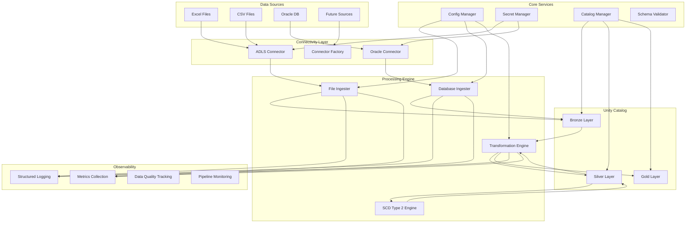
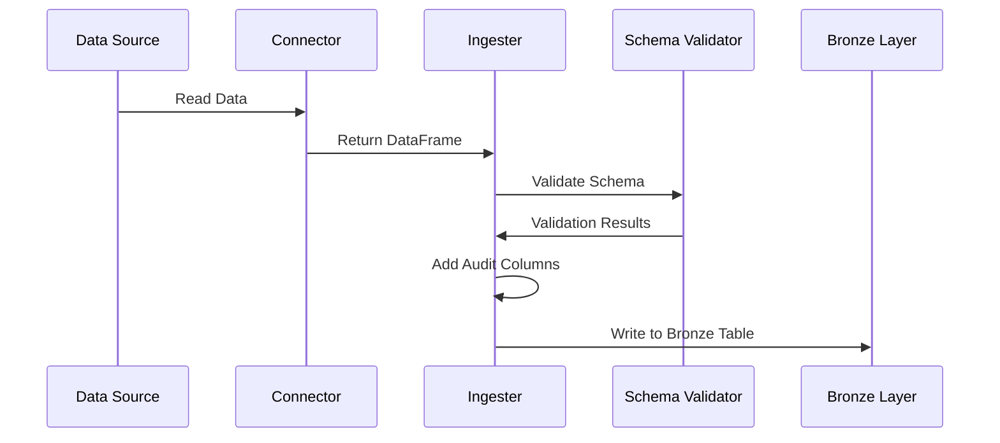
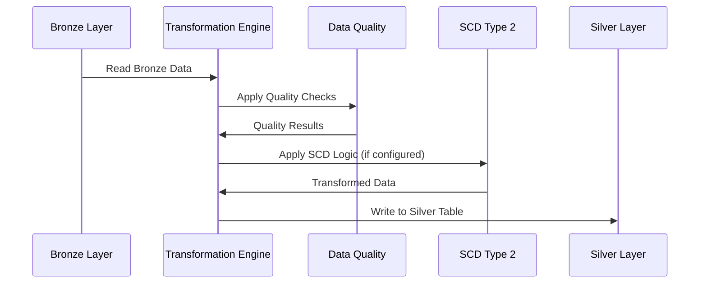
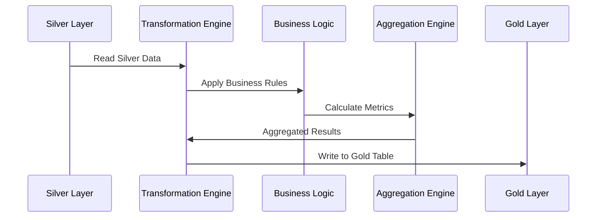
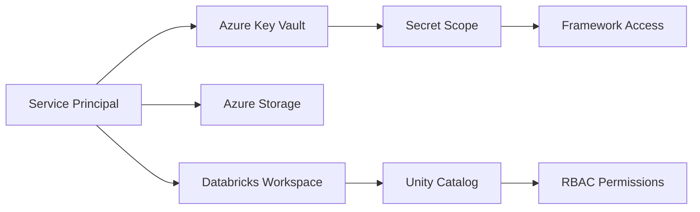
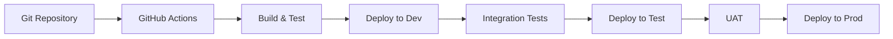

# Framework Overview

This document provides a comprehensive architectural overview of the Common Data Platform framework, explaining its design principles, components, and how they work together.

## Architecture Philosophy

The Common Data Platform is built on several key architectural principles:

### 1. **Configuration-Driven Design**
- **Zero Hardcoded Values**: All behavior is externalized to YAML configuration files
- **Environment Agnostic**: Same code runs across dev/test/prod with different configs
- **Dynamic Resolution**: Environment variables and templating support

### 2. **Modular Architecture**
- **Separation of Concerns**: Clear boundaries between connectivity, ingestion, transformation
- **Pluggable Components**: Easy to add new connectors and transformers
- **Reusable Modules**: Common functionality shared across components

### 3. **Cloud-Native Design**
- **Unity Catalog First**: Built specifically for Databricks Unity Catalog
- **Azure Integration**: Native integration with Azure services
- **Scalable by Default**: Leverages Spark's distributed computing

### 4. **Production Ready**
- **Comprehensive Error Handling**: Retry mechanisms and graceful degradation
- **Observability**: Structured logging and metrics collection
- **Security**: Azure Key Vault integration and RBAC support

## High-Level Architecture



## Core Components

### 1. Configuration Management (`src/core/config_manager.py`)

**Purpose**: Central configuration management with environment-aware resolution

**Key Features**:
- YAML configuration loading with caching
- Environment variable substitution
- Catalog name generation (e.g., `cddp-dev-bronze`)
- Configuration validation

**Example Usage**:
```python
config_manager = ConfigManager()
catalog_name = config_manager.get_catalog_name("bronze")  # Returns: cddp-dev-bronze
source_config = config_manager.load_source_config("excel")
```

### 2. Connectivity Layer (`src/connectivity/`)

**Purpose**: Abstracted connectivity to various data sources

**Components**:
- `BaseConnector`: Abstract interface for all connectors
- `ADLSConnector`: Azure Data Lake Storage Gen2 connectivity
- `OracleConnector`: Oracle database JDBC connectivity
- `ConnectorFactory`: Factory for creating appropriate connectors

**Key Features**:
- Consistent interface across all source types
- Built-in retry mechanisms
- Connection pooling and optimization
- Security integration

### 3. Ingestion Engine (`src/ingestion/`)

**Purpose**: Data ingestion from sources to bronze layer

**Components**:
- `BaseIngester`: Common ingestion functionality
- `FileIngester`: Excel, CSV, and file-based sources
- `DatabaseIngester`: Oracle and database sources

**Key Features**:
- Schema validation and enforcement
- Incremental and full load modes
- File tracking and deduplication
- Audit column addition
- Error handling and recovery

### 4. Transformation Engine (`src/transformation/`)

**Purpose**: Data transformation between medallion layers

**Components**:
- `TransformationEngine`: Orchestrates transformations
- `PySparkTransformer`: Python-based transformations
- `SparkSQLTransformer`: SQL-based transformations
- `SCDType2Transformer`: Slowly changing dimension handling

**Key Features**:
- Support for both PySpark and SparkSQL
- Configuration-driven transformation rules
- SCD Type 2 implementation
- Data lineage tracking

### 5. Utilities (`src/utilities/`)

**Purpose**: Common utilities and helper functions

**Components**:
- `SchemaValidator`: Data schema validation
- `ErrorHandler`: Centralized error handling
- `Logger`: Structured logging
- `DataQualityChecker`: Data quality validation

## Data Flow Architecture

### Bronze Layer (Raw Ingestion)



**Characteristics**:
- **No Business Logic**: Raw data preservation
- **Schema Validation**: Ensure data quality at entry
- **Audit Columns**: Track ingestion metadata
- **Error Isolation**: Failed records don't block others

### Silver Layer (Cleansed & Conformed)



**Characteristics**:
- **Data Cleansing**: Remove duplicates, handle nulls
- **Standardization**: Consistent formats and values
- **SCD Type 2**: Historical tracking for dimensions
- **Quality Gates**: Enforce quality standards

### Gold Layer (Business Ready)



**Characteristics**:
- **Business Logic**: KPIs, calculations, derived metrics
- **Denormalization**: Optimized for analytics
- **Aggregations**: Pre-calculated summaries
- **Performance Optimized**: Fast query response

## Unity Catalog Organization

### Catalog Structure

```
Project: cddp (Common Data Platform)
├── cddp-dev-bronze/
│   ├── excel_data/          # Excel file sources
│   │   ├── daily_sales
│   │   ├── customer_master
│   │   └── product_catalog
│   ├── csv_data/            # CSV file sources
│   │   ├── web_analytics
│   │   └── survey_responses
│   ├── oracle_data/         # Oracle database sources
│   │   ├── customers
│   │   ├── orders
│   │   ├── order_items
│   │   ├── products
│   │   ├── inventory
│   │   ├── suppliers
│   │   └── warehouses
│   └── system/              # Framework metadata
│       ├── processed_files
│       ├── watermarks
│       └── data_quality_results
├── cddp-dev-silver/
│   ├── excel_data/          # Cleansed Excel data
│   │   ├── sales_cleansed
│   │   ├── dim_customers_scd2
│   │   └── dim_products
│   ├── csv_data/            # Cleansed CSV data
│   └── oracle_data/         # Cleansed Oracle data
│       ├── customers_clean
│       ├── orders_enriched
│       └── dim_products
└── cddp-dev-gold/
    ├── analytics/           # Business analytics
    │   ├── customer_360
    │   ├── sales_performance
    │   └── inventory_metrics
    └── reporting/           # Reporting datasets
        ├── monthly_sales_summary
        ├── customer_segmentation
        └── operational_kpis
```

### Naming Conventions

- **Catalogs**: `{project_code}-{environment}-{layer}`
- **Schemas**: Source system or functional area
- **Tables**: Descriptive names indicating content and processing level

## Security Architecture

### Authentication & Authorization



**Security Layers**:
1. **Azure AD Authentication**: Service principal or user authentication
2. **Key Vault Integration**: Centralized secret management
3. **Unity Catalog RBAC**: Fine-grained access control
4. **Network Security**: VNet integration and private endpoints

### Secret Management

```yaml
# Secrets stored in Azure Key Vault
secrets:
  oracle-username: "service_account"
  oracle-password: "encrypted_password"
  storage-account-key: "encrypted_storage_key"
  
# Referenced in configuration
connection:
  secret_scope: "databricks-secrets-prod"
  username_key: "oracle-username"
  password_key: "oracle-password"
```

## Scalability & Performance

### Horizontal Scaling

- **Spark Distribution**: Automatic workload distribution across cluster nodes
- **Parallel Processing**: Multiple sources and tables processed concurrently
- **Dynamic Clustering**: Auto-scaling based on workload

### Performance Optimizations

- **Delta Lake**: ACID transactions and time travel
- **Data Skipping**: Efficient query performance with Z-ordering
- **Adaptive Query Execution**: Spark's built-in optimizations
- **Connection Pooling**: Efficient database connections

### Resource Management

```yaml
# Environment-specific resource allocation
spark:
  dev:
    max_workers: 2
    node_type: Standard_DS3_v2
  prod:
    max_workers: 8
    node_type: Standard_DS4_v2
```

## Extensibility Points

### Adding New Data Sources

1. **Create Connector**: Extend `BaseConnector`
2. **Register with Factory**: Add to `ConnectorFactory`
3. **Add Configuration**: Create source configuration template
4. **Implement Ingester**: Custom ingestion logic if needed

### Adding New Transformations

1. **PySpark Transformation**: Create Python module with transform function
2. **SparkSQL Transformation**: Create SQL file with transformation logic
3. **Configuration**: Add transformation definition to YAML
4. **Registration**: Register with transformation engine

### Custom Data Quality Checks

1. **Extend Validator**: Add new check types to `DataQualityChecker`
2. **Configuration**: Define check parameters in source configuration
3. **Integration**: Automatic execution during ingestion/transformation

## Deployment Architecture

### CI/CD Pipeline



### Environment Promotion

- **Configuration-driven**: Same code, different configurations
- **Asset Bundles**: Databricks native deployment
- **Automated Testing**: Quality gates at each stage
- **Rollback Capability**: Quick recovery from issues

This architecture provides a robust, scalable, and maintainable foundation for enterprise data ingestion and processing needs.