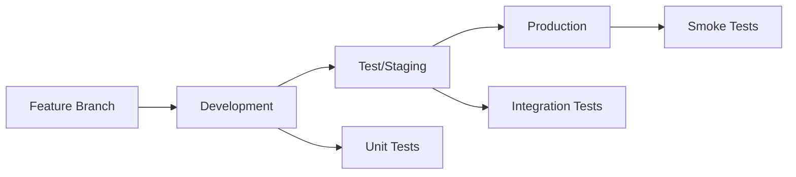

# Environment Management Guide

This guide covers managing multiple environments (development, test, production) for the Common Data Platform framework, including deployment strategies, configuration management, and promotion workflows.

## Environment Strategy Overview

The framework supports a standard three-environment approach:

- **Development** - Feature development and testing
- **Test/Staging** - Integration testing and UAT
- **Production** - Live business operations

## Environment Configuration

### Environment-Specific Settings

Each environment has its own configuration file in `config/environments/`:

#### Development Environment (`dev.yaml`)
```yaml
azure:
  storage_account: stadatplatformdev
  key_vault_url: https://kv-data-platform-dev.vault.azure.net/
  secret_scope: databricks-secrets-dev
  resource_group: rg-data-platform-dev

databricks:
  workspace_url: https://adb-1234567890123456.14.azuredatabricks.net
  
spark:
  max_workers: 4
  node_type: Standard_DS3_v2
  
data_quality:
  fail_on_error: false
  max_error_threshold: 10

logging:
  level: DEBUG
  
cost_optimization:
  auto_terminate_minutes: 30
  use_spot_instances: true
```

#### Test Environment (`test.yaml`)
```yaml
azure:
  storage_account: stadatplatformtest
  key_vault_url: https://kv-data-platform-test.vault.azure.net/
  secret_scope: databricks-secrets-test
  resource_group: rg-data-platform-test

databricks:
  workspace_url: https://adb-0987654321098765.14.azuredatabricks.net
  
spark:
  max_workers: 6
  node_type: Standard_DS3_v2
  
data_quality:
  fail_on_error: true
  max_error_threshold: 5

logging:
  level: INFO
  
cost_optimization:
  auto_terminate_minutes: 60
  use_spot_instances: false
```

#### Production Environment (`prod.yaml`)
```yaml
azure:
  storage_account: stadatplatformprod
  key_vault_url: https://kv-data-platform-prod.vault.azure.net/
  secret_scope: databricks-secrets-prod
  resource_group: rg-data-platform-prod

databricks:
  workspace_url: https://adb-5555666677778888.14.azuredatabricks.net
  
spark:
  max_workers: 16
  node_type: Standard_DS4_v2
  
data_quality:
  fail_on_error: true
  max_error_threshold: 1

logging:
  level: INFO
  
cost_optimization:
  auto_terminate_minutes: 120
  use_spot_instances: false
  
alerts:
  enabled: true
  notification_channels:
    - email: data-engineering@company.com
    - slack: "#data-alerts"
```

### Environment Variable Management

#### Local Development
```bash
# .env.dev
export PROJECT_CODE=cddp
export ENVIRONMENT=dev
export AZURE_STORAGE_ACCOUNT_DEV=stadatplatformdev
export AZURE_KEY_VAULT_URL_DEV=https://kv-data-platform-dev.vault.azure.net/
export DATABRICKS_HOST_DEV=https://adb-1234567890123456.14.azuredatabricks.net
export DATABRICKS_TOKEN_DEV=your-dev-token
```

#### CI/CD Pipeline Variables
```yaml
# GitHub Actions environment variables
env:
  AZURE_CLIENT_ID: ${{ secrets.AZURE_CLIENT_ID }}
  AZURE_CLIENT_SECRET: ${{ secrets.AZURE_CLIENT_SECRET }}
  AZURE_TENANT_ID: ${{ secrets.AZURE_TENANT_ID }}
  DATABRICKS_HOST_DEV: ${{ secrets.DATABRICKS_HOST_DEV }}
  DATABRICKS_TOKEN_DEV: ${{ secrets.DATABRICKS_TOKEN_DEV }}
  DATABRICKS_HOST_PROD: ${{ secrets.DATABRICKS_HOST_PROD }}
  DATABRICKS_TOKEN_PROD: ${{ secrets.DATABRICKS_TOKEN_PROD }}
```

## Deployment Strategies

### 1. Databricks Asset Bundle Deployment

#### Bundle Configuration
```yaml
# databricks.yml
bundle:
  name: common-data-platform

environments:
  dev:
    mode: development
    workspace:
      host: https://adb-1234567890123456.14.azuredatabricks.net
    resources:
      jobs:
        data_ingestion_dev:
          name: "Data Ingestion Pipeline - Dev"
          job_clusters:
            - job_cluster_key: main_cluster
              new_cluster:
                node_type_id: Standard_DS3_v2
                num_workers: 2
                spark_version: 16.4.x-scala2.12
          
  test:
    mode: production
    workspace:
      host: https://adb-0987654321098765.14.azuredatabricks.net
    resources:
      jobs:
        data_ingestion_test:
          name: "Data Ingestion Pipeline - Test"
          job_clusters:
            - job_cluster_key: main_cluster
              new_cluster:
                node_type_id: Standard_DS3_v2
                num_workers: 4
                spark_version: 16.4.x-scala2.12
          
  prod:
    mode: production
    workspace:
      host: https://adb-5555666677778888.14.azuredatabricks.net
    resources:
      jobs:
        data_ingestion_prod:
          name: "Data Ingestion Pipeline - Production"
          job_clusters:
            - job_cluster_key: main_cluster
              new_cluster:
                node_type_id: Standard_DS4_v2
                num_workers: 12
                spark_version: 16.4.x-scala2.12
          schedule:
            quartz_cron_expression: "0 0 6 * * ?"
            timezone_id: "UTC"
          email_notifications:
            on_failure:
              - data-engineering@company.com
```

#### Deployment Commands
```bash
# Deploy to development
databricks bundle deploy -t dev

# Deploy to test
databricks bundle deploy -t test

# Deploy to production
databricks bundle deploy -t prod
```

### 2. Infrastructure as Code (IaC)

#### Terraform Configuration
```hcl
# environments/dev/main.tf
module "data_platform" {
  source = "../../modules/data-platform"
  
  environment = "dev"
  project_code = "cddp"
  
  # Resource sizing for dev
  databricks_sku = "standard"
  cluster_node_type = "Standard_DS3_v2"
  cluster_max_workers = 4
  
  # Cost optimization for dev
  auto_terminate_minutes = 30
  enable_spot_instances = true
  
  tags = {
    Environment = "dev"
    Project = "common-data-platform"
    CostCenter = "data-engineering"
  }
}
```

```hcl
# environments/prod/main.tf
module "data_platform" {
  source = "../../modules/data-platform"
  
  environment = "prod"
  project_code = "cddp"
  
  # Resource sizing for prod
  databricks_sku = "premium"
  cluster_node_type = "Standard_DS4_v2"
  cluster_max_workers = 16
  
  # Production settings
  auto_terminate_minutes = 120
  enable_spot_instances = false
  enable_backup = true
  
  tags = {
    Environment = "prod"
    Project = "common-data-platform"
    CostCenter = "data-engineering"
    Criticality = "high"
  }
}
```

## Promotion Workflows

### 1. Code Promotion Pipeline

#### GitFlow Strategy


#### GitHub Actions Workflow
```yaml
# .github/workflows/promote.yml
name: Environment Promotion

on:
  push:
    branches: [develop, main]
  pull_request:
    branches: [main]

jobs:
  deploy-dev:
    if: github.ref == 'refs/heads/develop'
    runs-on: ubuntu-latest
    environment: development
    steps:
      - uses: actions/checkout@v3
      
      - name: Setup Python
        uses: actions/setup-python@v4
        with:
          python-version: '3.9'
          
      - name: Install dependencies
        run: |
          pip install databricks-cli
          pip install -r requirements-lock.txt
          
      - name: Deploy to Development
        env:
          DATABRICKS_HOST: ${{ secrets.DATABRICKS_HOST_DEV }}
          DATABRICKS_TOKEN: ${{ secrets.DATABRICKS_TOKEN_DEV }}
        run: |
          databricks bundle deploy -t dev
          
  deploy-test:
    if: github.ref == 'refs/heads/main'
    runs-on: ubuntu-latest
    environment: test
    needs: [run-tests]
    steps:
      - uses: actions/checkout@v3
      
      - name: Deploy to Test
        env:
          DATABRICKS_HOST: ${{ secrets.DATABRICKS_HOST_TEST }}
          DATABRICKS_TOKEN: ${{ secrets.DATABRICKS_TOKEN_TEST }}
        run: |
          databricks bundle deploy -t test
          
      - name: Run Integration Tests
        run: |
          python scripts/run_integration_tests.py --environment test
          
  deploy-prod:
    if: github.ref == 'refs/heads/main'
    runs-on: ubuntu-latest
    environment: production
    needs: [deploy-test]
    steps:
      - uses: actions/checkout@v3
      
      - name: Deploy to Production
        env:
          DATABRICKS_HOST: ${{ secrets.DATABRICKS_HOST_PROD }}
          DATABRICKS_TOKEN: ${{ secrets.DATABRICKS_TOKEN_PROD }}
        run: |
          databricks bundle deploy -t prod
          
      - name: Run Smoke Tests
        run: |
          python scripts/run_smoke_tests.py --environment prod
```

### 2. Configuration Promotion

#### Configuration Validation
```python
class ConfigurationValidator:
    def __init__(self, environment: str):
        self.environment = environment
        
    def validate_promotion(self, source_env: str, target_env: str) -> ValidationResult:
        """Validate configuration before promotion."""
        
        validation_results = []
        
        # Check required environment variables
        validation_results.append(self._validate_env_vars(target_env))
        
        # Check Azure resource accessibility
        validation_results.append(self._validate_azure_resources(target_env))
        
        # Check Databricks connectivity
        validation_results.append(self._validate_databricks_access(target_env))
        
        # Check configuration consistency
        validation_results.append(self._validate_config_consistency(source_env, target_env))
        
        return ValidationResult(
            environment=target_env,
            validations=validation_results,
            overall_result=all(v.passed for v in validation_results)
        )
```

#### Automated Configuration Sync
```bash
#!/bin/bash
# scripts/promote_config.sh

SOURCE_ENV=$1
TARGET_ENV=$2

echo "Promoting configuration from $SOURCE_ENV to $TARGET_ENV"

# Validate source environment
python scripts/validate_environment.py --environment $SOURCE_ENV

# Backup target environment configuration
python scripts/backup_config.py --environment $TARGET_ENV

# Sync configuration files
rsync -av --exclude="*.env" config/environments/$SOURCE_ENV/ config/environments/$TARGET_ENV/

# Update environment-specific values
python scripts/update_env_config.py --environment $TARGET_ENV

# Validate target environment
python scripts/validate_environment.py --environment $TARGET_ENV

echo "Configuration promotion completed"
```

## Environment-Specific Features

### Development Environment

#### Features
- **Fast Development Cycle** - Quick cluster startup
- **Debugging Support** - Verbose logging and detailed error messages
- **Cost Optimization** - Spot instances and auto-termination
- **Flexible Schema** - Relaxed validation for experimentation

#### Configuration
```yaml
development:
  features:
    debug_mode: true
    schema_evolution: true
    auto_fix_issues: true
    cost_optimization: aggressive
    
  data_sources:
    use_sample_data: true
    sample_percentage: 10
    
  quality_checks:
    severity: warning
    auto_remediation: true
```

### Test Environment

#### Features
- **Production-like Data** - Masked/anonymized production data
- **Integration Testing** - End-to-end pipeline validation
- **Performance Testing** - Load and stress testing
- **Security Testing** - Permission and access validation

#### Configuration
```yaml
test:
  features:
    production_like: true
    data_masking: true
    performance_monitoring: true
    security_scanning: true
    
  data_sources:
    use_production_schema: true
    data_retention_days: 30
    
  quality_checks:
    severity: error
    comprehensive_validation: true
```

### Production Environment

#### Features
- **High Availability** - Multi-AZ deployment
- **Disaster Recovery** - Automated backups and replication
- **Monitoring & Alerting** - Comprehensive observability
- **Compliance** - Audit logging and data governance

#### Configuration
```yaml
production:
  features:
    high_availability: true
    disaster_recovery: true
    audit_logging: comprehensive
    compliance_monitoring: true
    
  data_sources:
    backup_enabled: true
    encryption_required: true
    
  quality_checks:
    severity: critical
    zero_tolerance: true
    
  monitoring:
    real_time_alerts: true
    sla_monitoring: true
```

## Production Deployment Best Practices

### 1. Pre-Deployment Checklist

#### Infrastructure Readiness
- [ ] Azure resources provisioned and accessible
- [ ] Databricks workspace configured with Unity Catalog
- [ ] Key Vault secrets populated and accessible
- [ ] Network security groups and firewall rules configured
- [ ] Monitoring and alerting systems ready

#### Code Readiness
- [ ] All unit tests passing
- [ ] Integration tests completed successfully
- [ ] Performance tests meet SLA requirements
- [ ] Security scans completed with no critical issues
- [ ] Code reviewed and approved

#### Configuration Readiness
- [ ] Environment-specific configurations validated
- [ ] Database connections tested
- [ ] File access permissions verified
- [ ] Transformation logic tested with production-like data
- [ ] Rollback procedures documented

### 2. Blue-Green Deployment

#### Setup
```yaml
# Blue-Green deployment configuration
environments:
  prod-blue:
    mode: production
    workspace:
      host: https://prod-blue.azuredatabricks.net
    
  prod-green:
    mode: production
    workspace:
      host: https://prod-green.azuredatabricks.net
```

#### Deployment Process
```bash
# Deploy to green environment
databricks bundle deploy -t prod-green

# Run validation tests
python scripts/validate_deployment.py --environment prod-green

# Switch traffic to green
python scripts/switch_traffic.py --from prod-blue --to prod-green

# Monitor for issues
python scripts/monitor_deployment.py --environment prod-green --duration 30m

# If successful, decommission blue
databricks bundle destroy -t prod-blue
```

### 3. Monitoring Production Health

#### Key Metrics to Monitor
```python
production_metrics = {
    'pipeline_success_rate': {'threshold': 99.5, 'alert': 'critical'},
    'data_quality_score': {'threshold': 95.0, 'alert': 'warning'},
    'processing_latency': {'threshold': 30, 'unit': 'minutes', 'alert': 'warning'},
    'cost_per_gb_processed': {'threshold': 0.10, 'unit': 'USD', 'alert': 'info'},
    'storage_growth_rate': {'threshold': 20, 'unit': 'percent_monthly', 'alert': 'info'}
}
```

#### Automated Health Checks
```python
def production_health_check():
    """Run comprehensive production health check."""
    
    health_status = {
        'overall': 'HEALTHY',
        'components': {}
    }
    
    # Check Unity Catalog access
    health_status['components']['unity_catalog'] = check_catalog_access()
    
    # Check data pipeline health
    health_status['components']['pipelines'] = check_pipeline_health()
    
    # Check data quality metrics
    health_status['components']['data_quality'] = check_data_quality()
    
    # Check cost metrics
    health_status['components']['cost_optimization'] = check_cost_metrics()
    
    # Determine overall health
    if any(status == 'CRITICAL' for status in health_status['components'].values()):
        health_status['overall'] = 'CRITICAL'
    elif any(status == 'WARNING' for status in health_status['components'].values()):
        health_status['overall'] = 'WARNING'
    
    return health_status
```

This comprehensive environment management strategy ensures smooth deployment and operation across all environments while maintaining high availability and cost efficiency in production.