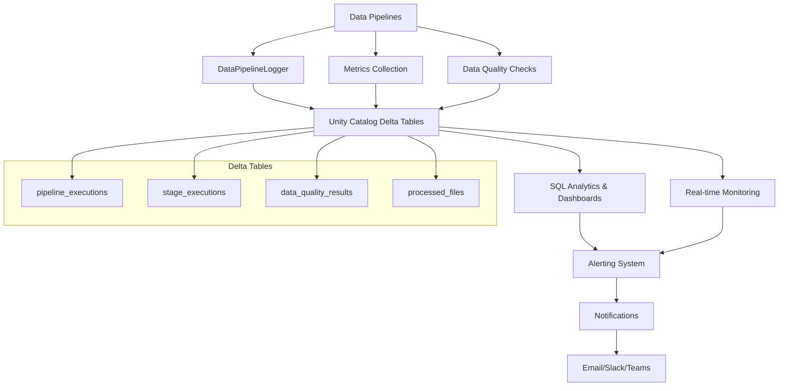

# Monitoring Guide

This guide covers comprehensive monitoring, observability, and alerting for the Common Data Platform framework.

## Overview

The framework provides multiple layers of monitoring using **Unity Catalog Delta tables** for centralized, scalable logging:
- **Pipeline Execution Monitoring** - Track pipeline runs and performance in Delta tables
- **Data Quality Monitoring** - Monitor data integrity and quality metrics with structured logging
- **Infrastructure Monitoring** - Track Databricks cluster and resource usage
- **Business Metrics Monitoring** - Monitor data freshness and business KPIs

All operational logs are stored as Delta tables in Unity Catalog, providing:
- **Structured Query Access** - Use SQL to analyze logs and metrics
- **Time Travel** - Access historical logging data
- **Performance** - Optimized Delta format for fast analytics
- **Governance** - Unified access control and lineage tracking

## Monitoring Architecture



## Built-in Monitoring Features

### 1. Structured Logging

The framework automatically logs structured information for all operations:

```python
# Example log output
{
  "timestamp": "2024-01-15T10:30:00Z",
  "level": "INFO",
  "logger": "file_ingester",
  "pipeline_id": "bronze_ingestion_daily_sales_20240115_103000",
  "event_type": "pipeline_start",
  "source": "daily_sales_excel",
  "environment": "prod",
  "project_code": "cddp"
}
```

### 2. Pipeline Metadata Tracking

Every pipeline run generates metadata:

```sql
-- View pipeline execution history
SELECT 
    pipeline_id,
    source_name,
    status,
    records_processed,
    duration_seconds,
    start_time,
    end_time
FROM cddp_prod_bronze.system.pipeline_executions
ORDER BY start_time DESC;
```

### 3. Data Quality Monitoring

Quality checks are tracked in the system:

```sql
-- Monitor data quality trends
SELECT 
    table_name,
    check_type,
    check_name,
    status,
    records_checked,
    records_failed,
    check_timestamp
FROM cddp_prod_bronze.system.data_quality_results
WHERE check_timestamp >= current_date() - INTERVAL 7 DAYS;
```

## Setting Up Monitoring

### 1. System Tables

The framework automatically creates monitoring tables during infrastructure provisioning:

```sql
-- Pipeline execution tracking
CREATE TABLE IF NOT EXISTS bronze.system.pipeline_executions (
    pipeline_id STRING,
    source_name STRING,
    pipeline_type STRING,
    status STRING,
    start_time TIMESTAMP,
    end_time TIMESTAMP,
    duration_seconds DOUBLE,
    records_processed BIGINT,
    files_processed BIGINT,
    error_message STRING,
    environment STRING,
    created_timestamp TIMESTAMP
);

-- Data quality results
CREATE TABLE IF NOT EXISTS bronze.system.data_quality_results (
    check_id STRING,
    table_name STRING,
    check_type STRING,
    check_name STRING,
    status STRING,
    result_details STRING,
    records_checked BIGINT,
    records_failed BIGINT,
    check_timestamp TIMESTAMP,
    environment STRING
);

-- File processing tracking
CREATE TABLE IF NOT EXISTS bronze.system.processed_files (
    file_path STRING,
    source_name STRING,
    processed_timestamp TIMESTAMP,
    file_size_bytes BIGINT,
    record_count BIGINT,
    processing_duration_seconds DOUBLE,
    status STRING,
    environment STRING
);
```

### 2. Monitoring Dashboards

Create Databricks SQL dashboards to visualize metrics:

#### Pipeline Health Dashboard

```sql
-- Pipeline Success Rate (Last 7 Days)
SELECT 
    DATE(start_time) as date,
    COUNT(*) as total_runs,
    SUM(CASE WHEN status = 'success' THEN 1 ELSE 0 END) as successful_runs,
    (SUM(CASE WHEN status = 'success' THEN 1 ELSE 0 END) * 100.0 / COUNT(*)) as success_rate
FROM cddp_prod_bronze.system.pipeline_executions
WHERE start_time >= current_date() - INTERVAL 7 DAYS
GROUP BY DATE(start_time)
ORDER BY date;

-- Average Processing Time by Source
SELECT 
    source_name,
    AVG(duration_seconds) as avg_duration,
    MAX(duration_seconds) as max_duration,
    COUNT(*) as run_count
FROM cddp_prod_bronze.system.pipeline_executions
WHERE start_time >= current_date() - INTERVAL 7 DAYS
    AND status = 'success'
GROUP BY source_name
ORDER BY avg_duration DESC;

-- Records Processed Trend
SELECT 
    DATE(start_time) as date,
    source_name,
    SUM(records_processed) as total_records
FROM cddp_prod_bronze.system.pipeline_executions
WHERE start_time >= current_date() - INTERVAL 30 DAYS
    AND status = 'success'
GROUP BY DATE(start_time), source_name
ORDER BY date, source_name;
```

#### Data Quality Dashboard

```sql
-- Data Quality Trend
SELECT 
    DATE(check_timestamp) as date,
    check_type,
    COUNT(*) as total_checks,
    SUM(CASE WHEN status = 'passed' THEN 1 ELSE 0 END) as passed_checks,
    (SUM(CASE WHEN status = 'passed' THEN 1 ELSE 0 END) * 100.0 / COUNT(*)) as pass_rate
FROM cddp_prod_bronze.system.data_quality_results
WHERE check_timestamp >= current_date() - INTERVAL 7 DAYS
GROUP BY DATE(check_timestamp), check_type
ORDER BY date, check_type;

-- Tables with Quality Issues
SELECT 
    table_name,
    check_type,
    COUNT(*) as failed_checks,
    MAX(check_timestamp) as last_failure
FROM cddp_prod_bronze.system.data_quality_results
WHERE status = 'failed'
    AND check_timestamp >= current_date() - INTERVAL 7 DAYS
GROUP BY table_name, check_type
ORDER BY failed_checks DESC;
```

### 3. Alerting Setup

#### Email Alerts

Configure email alerts for critical failures:

```sql
-- Create alert for pipeline failures
CREATE OR REFRESH STREAMING LIVE TABLE pipeline_alerts AS
SELECT 
    pipeline_id,
    source_name,
    status,
    error_message,
    start_time,
    'critical' as severity
FROM STREAM(cddp_prod_bronze.system.pipeline_executions)
WHERE status = 'failed'
    AND source_name IN ('oracle_erp_system', 'daily_sales_excel');  -- Critical sources only
```

#### Slack Integration

Set up Slack notifications using Databricks webhooks:

```python
# Example webhook configuration in Databricks Jobs
{
  "webhook_notifications": {
    "on_failure": [
      {
        "id": "slack-alerts",
        "webhook": {
          "url": "https://hooks.slack.com/services/YOUR/SLACK/WEBHOOK"
        }
      }
    ]
  }
}
```

### 4. Custom Monitoring Notebooks

Create monitoring notebooks for deeper analysis:

#### Pipeline Health Analysis

```python
# Databricks notebook: Pipeline Health Analysis
import matplotlib.pyplot as plt
import seaborn as sns

# Get pipeline performance data
df = spark.sql("""
    SELECT 
        source_name,
        DATE(start_time) as date,
        AVG(duration_seconds) as avg_duration,
        COUNT(*) as run_count,
        SUM(CASE WHEN status = 'success' THEN 1 ELSE 0 END) as success_count
    FROM cddp_prod_bronze.system.pipeline_executions
    WHERE start_time >= current_date() - INTERVAL 30 DAYS
    GROUP BY source_name, DATE(start_time)
""").toPandas()

# Create performance visualization
plt.figure(figsize=(12, 6))
sns.lineplot(data=df, x='date', y='avg_duration', hue='source_name')
plt.title('Pipeline Performance Trend (30 Days)')
plt.xticks(rotation=45)
plt.show()

# Success rate by source
success_rate = df.groupby('source_name').apply(
    lambda x: x['success_count'].sum() / x['run_count'].sum() * 100
).sort_values(ascending=False)

print("Success Rate by Source:")
print(success_rate)
```

#### Data Freshness Monitoring

```python
# Monitor data freshness
freshness_query = """
    WITH latest_data AS (
        SELECT 
            'daily_sales' as table_name,
            MAX(transaction_date) as latest_date,
            current_date() as today,
            datediff(current_date(), MAX(transaction_date)) as days_old
        FROM cddp_prod_silver.excel_data.sales_cleansed
        
        UNION ALL
        
        SELECT 
            'oracle_customers' as table_name,
            MAX(last_modified_date) as latest_date,
            current_date() as today,
            datediff(current_date(), MAX(last_modified_date)) as days_old
        FROM cddp_prod_silver.oracle_data.customers
    )
    SELECT 
        table_name,
        latest_date,
        days_old,
        CASE 
            WHEN days_old <= 1 THEN 'Fresh'
            WHEN days_old <= 3 THEN 'Slightly Stale'
            ELSE 'Stale'
        END as freshness_status
    FROM latest_data
"""

freshness_df = spark.sql(freshness_query)
display(freshness_df)
```

## Monitoring Best Practices

### 1. Define Key Metrics

Track these essential metrics for each pipeline:

- **Availability**: Pipeline success rate (target: >99%)
- **Performance**: Average processing time (track trends)
- **Data Quality**: Quality check pass rate (target: >95%)
- **Data Freshness**: Time since last successful update
- **Volume**: Records processed per run (detect anomalies)

### 2. Set Up Alerting Tiers

Configure different alert severities:

```yaml
# Critical Alerts (Immediate Response)
critical_alerts:
  - pipeline_failure: oracle_erp_system  # Business critical
  - data_quality_failure: customer_data  # Downstream impact
  - infrastructure_failure: cluster_down

# Warning Alerts (Monitor Closely)  
warning_alerts:
  - performance_degradation: >2x normal duration
  - data_freshness: >24 hours old
  - quality_degradation: <90% pass rate

# Info Alerts (Awareness)
info_alerts:
  - new_files_detected: file counts
  - successful_completion: large pipelines
```

### 3. Automate Responses

Set up automated responses where possible:

```python
# Example: Auto-retry failed pipelines
def auto_retry_handler(pipeline_id, source_name):
    """Automatically retry failed pipelines with specific conditions."""
    
    # Check if failure is retryable
    if is_retryable_error(pipeline_id):
        # Wait for backoff period
        time.sleep(calculate_backoff(attempt_number))
        
        # Retry the pipeline
        retry_pipeline(source_name, pipeline_id)
        
        # Log the retry attempt
        log_retry_attempt(pipeline_id, attempt_number)
```

### 4. Regular Health Checks

Schedule automated health check reports:

```sql
-- Weekly health check report
WITH weekly_summary AS (
    SELECT 
        source_name,
        COUNT(*) as total_runs,
        SUM(CASE WHEN status = 'success' THEN 1 ELSE 0 END) as successful_runs,
        AVG(duration_seconds) as avg_duration,
        SUM(records_processed) as total_records
    FROM cddp_prod_bronze.system.pipeline_executions
    WHERE start_time >= current_date() - INTERVAL 7 DAYS
    GROUP BY source_name
)
SELECT 
    source_name,
    total_runs,
    successful_runs,
    ROUND((successful_runs * 100.0 / total_runs), 2) as success_rate_pct,
    ROUND(avg_duration / 60, 2) as avg_duration_minutes,
    total_records
FROM weekly_summary
ORDER BY success_rate_pct ASC;  -- Show problematic sources first
```

## Operational Monitoring

### 1. Real-time Monitoring

Monitor active pipelines in real-time:

```python
# Real-time pipeline status check
def check_active_pipelines():
    active_pipelines = spark.sql("""
        SELECT 
            pipeline_id,
            source_name,
            start_time,
            (unix_timestamp() - unix_timestamp(start_time)) / 60 as running_minutes
        FROM cddp_prod_bronze.system.pipeline_executions
        WHERE status = 'running'
            AND start_time >= current_timestamp() - INTERVAL 4 HOURS
    """)
    
    # Alert on long-running pipelines
    long_running = active_pipelines.filter(col("running_minutes") > 120)  # 2 hours
    
    if long_running.count() > 0:
        send_alert("Long running pipelines detected", long_running.collect())
```

### 2. Resource Monitoring

Monitor Databricks cluster resource usage:

```python
# Monitor cluster utilization
cluster_metrics = spark.sql("""
    SELECT 
        cluster_id,
        cluster_name,
        driver_node_type,
        worker_node_type,
        num_workers,
        uptime_seconds,
        current_timestamp() as check_time
    FROM cluster_events
    WHERE event_type = 'RUNNING'
""")
```

### 3. Cost Monitoring

Track pipeline costs and resource usage:

```sql
-- Estimate pipeline costs
SELECT 
    source_name,
    COUNT(*) as runs,
    AVG(duration_seconds / 3600) as avg_hours,
    SUM(duration_seconds / 3600) as total_hours,
    -- Multiply by your DBU rate for cost estimation
    SUM(duration_seconds / 3600) * 0.5 as estimated_cost_usd  
FROM cddp_prod_bronze.system.pipeline_executions
WHERE start_time >= current_date() - INTERVAL 30 DAYS
    AND status = 'success'
GROUP BY source_name
ORDER BY total_hours DESC;
```

## Troubleshooting Monitoring Issues

### Common Monitoring Problems

1. **Missing Logs**
   ```bash
   # Check if logging is configured
   python -c "import logging; print(logging.getLogger().level)"
   
   # Verify log level in environment config
   cat config/environments/prod.yaml | grep -A5 logging
   ```

2. **System Tables Not Created**
   ```bash
   # Re-run infrastructure provisioning
   python scripts/provision_infrastructure.py --environments prod
   ```

3. **No Metrics Appearing**
   ```sql
   -- Check if system tables exist
   SHOW TABLES IN cddp_prod_bronze.system;
   
   -- Check for recent data
   SELECT COUNT(*) FROM cddp_prod_bronze.system.pipeline_executions
   WHERE start_time >= current_date() - INTERVAL 1 DAYS;
   ```

4. **Alerts Not Firing**
   ```python
   # Test alert configuration
   test_alert_webhook("Test message from monitoring system")
   
   # Verify alert conditions
   check_alert_thresholds()
   ```

This monitoring setup provides comprehensive visibility into your data platform operations, helping ensure reliability and performance of your data pipelines.